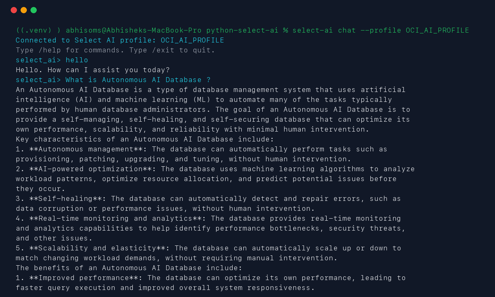
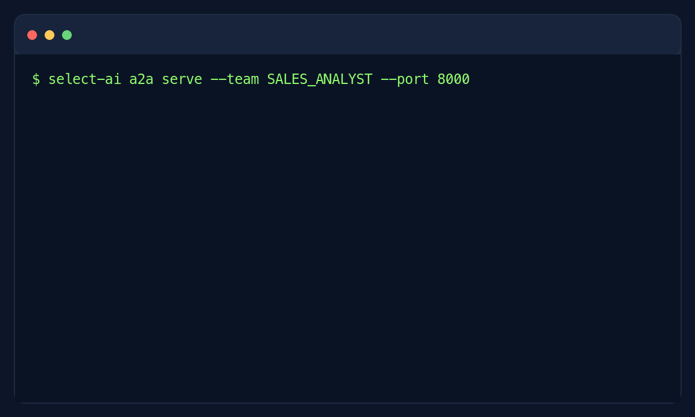

# Select AI for Python


Select AI for Python enables you to ask questions of your database data using natural language (text-to-SQL), get generative AI responses using your trusted content (retrieval augmented generation), generate synthetic data using large language models, and other features – all from Python. With the general availability of Select AI Python, Python developers have access to the functionality of Select AI on Oracle Autonomous Database.

Select AI for Python enables you to leverage the broader Python ecosystem in combination with generative AI and database functionality - bridging the gap between the DBMS_CLOUD_AI PL/SQL package and Python's rich ecosystem. It provides intuitive objects and methods for AI model interaction.

## Table of Contents

- [Installation](#installation)
- [Documentation](#documentation)
- [Getting Started](#getting-started)
  - [Async Example](#async-example)
- [Command Line Interface](#command-line-interface)
  - [Chat](#chat)
  - [A2A Server](#a2a-server)
    - [Cloud Run](#cloud-run)
- [Samples](#samples)
- [Help](#help)
- [Contributing](#contributing)
- [Security](#security)
- [License](#license)


## Installation

Install the Python package:

```bash
python3 -m pip install select_ai
```

Install the optional command line interface:

```bash
python3 -m pip install 'select_ai[cli]'
```

The CLI extra includes A2A server support.

## Documentation

See [Select AI for Python documentation][documentation]

## Getting Started

```python
import select_ai

user = "<your_select_ai_user>"
password = "<your_select_ai_password>"
dsn = "<your_select_ai_db_connect_string>"

select_ai.connect(user=user, password=password, dsn=dsn)
profile = select_ai.Profile(profile_name="oci_ai_profile")
# run_sql returns a pandas dataframe
df = profile.run_sql(prompt="How many promotions?")
print(df.columns)
print(df)
```

### Async Example

```python

import asyncio

import select_ai

user = "<your_select_ai_user>"
password = "<your_select_ai_password>"
dsn = "<your_select_ai_db_connect_string>"

# This example shows how to asynchronously run sql
async def main():
    await select_ai.async_connect(user=user, password=password, dsn=dsn)
    async_profile = await select_ai.AsyncProfile(
        profile_name="async_oci_ai_profile",
    )
    # run_sql returns a pandas df
    df = await async_profile.run_sql("How many promotions?")
    print(df)

asyncio.run(main())

```

## Command Line Interface

The optional `select-ai` command provides interactive chat, SQL, profile
management, and A2A server tools for Select AI:

### Chat

```bash
select-ai chat --profile OCI_AI_PROFILE
```



### A2A Server

Expose one Oracle Database AI agent team as an A2A JSON-RPC HTTP server:

```bash
select-ai a2a serve --team SALES_ANALYST --port 8000
```



The command obtains database connection settings from its options or the
`SELECT_AI_*` environment variables. Its Agent Card is available at
`/.well-known/agent-card.json`, and its JSON-RPC endpoint is
`/a2a/jsonrpc/`. Set `--public-url` when the server is behind a proxy or load
balancer so that clients receive its externally reachable URL.

For Autonomous Database mTLS, also set `SELECT_AI_WALLET_LOCATION` to the
directory containing the unzipped wallet and set `SELECT_AI_WALLET_PASSWORD`.
The CLI passes both values to the Select AI SDK as `wallet_location` and
`wallet_password`.

The server accepts both A2A 1.x and the A2A v0.3 JSON-RPC streaming protocol
for compatibility with Gemini Enterprise.

See the [A2A user guide](doc/source/user_guide/a2a.rst) for the dynamic
gateway, A2UI connection flow, persistent task state, task polling and
cancellation, wallet configuration, and Google Cloud deployment modes.

Generate the A2A v0.3 Agent Card to paste into Gemini Enterprise after the
service has a public URL:

```bash
select-ai a2a agent-card \
  --team ORACLE_AI_DATABASE_AGENT \
  --public-url https://YOUR-SERVICE.run.app
```

#### Cloud Run

Deploy the A2A server to Cloud Run using the instructions in
[gcloud/README.md](https://github.com/oracle/python-select-ai/blob/main/gcloud/README.md).

## Samples

For in-depth examples, see the [/samples][samples] directory.

## Help

Questions can be asked in [GitHub Discussions][ghdiscussions].

Problem reports can be raised in [GitHub Issues][ghissues].

## Contributing

This project welcomes contributions from the community. Before submitting a pull request, please [review our contribution guide][contributing]

## Security

Please consult the [security guide][security] for our responsible security vulnerability disclosure process

## License

Copyright (c) 2025, 2026 Oracle and/or its affiliates.

Released under the Universal Permissive License v1.0 as shown at
<https://oss.oracle.com/licenses/upl/>.

[contributing]: https://github.com/oracle/python-select-ai/blob/main/CONTRIBUTING.md
[documentation]: https://oracle.github.io/python-select-ai/
[ghdiscussions]: https://github.com/oracle/python-select-ai/discussions
[ghissues]: https://github.com/oracle/python-select-ai/issues
[samples]: https://github.com/oracle/python-select-ai/tree/main/samples
[security]: https://github.com/oracle/python-select-ai/blob/main/SECURITY.md
