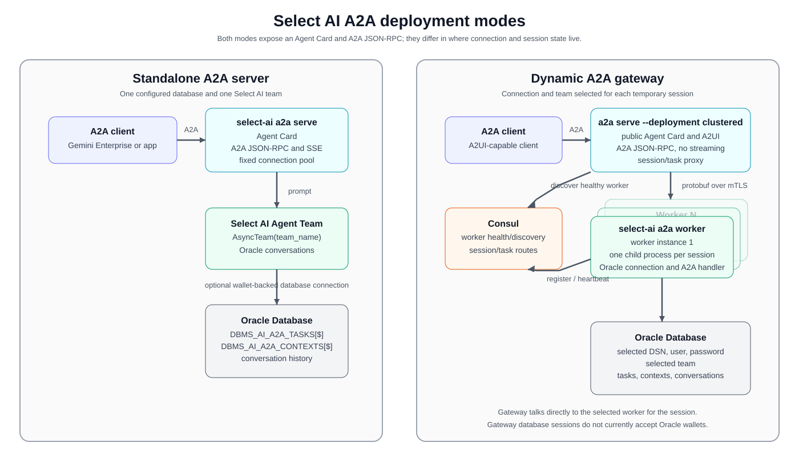

# Google Cloud deployment modes

Select AI for Python supports two A2A deployment architectures. The key
decisions are where the database connection and Select AI team are selected,
which components carry the session, and how capacity is added:

- Standalone fixes the database and team at deployment time. One Cloud Run A2A
  service owns the configured connection pool and serves that team.
- The gateway selects the database and team per user session. A Cloud Run A2A
  gateway routes sessions through Consul to a clustered GKE worker pool, with
  one isolated child runtime and database connection pool per active session.

The gateway architecture is designed for horizontal session capacity. Gateway
instances, Consul, and worker replicas are separate components; adding worker
replicas increases the number of concurrent database sessions that can be
hosted behind the same A2A endpoint. Consul preserves session and task affinity
when requests reach different gateway instances. Oracle Database capacity and
the configured session TTL remain the limiting factors.



The A2A commands are cloud-neutral: `select-ai a2a serve`,
`select-ai a2a gateway`, and `select-ai a2a worker` can run as processes or
containers on any cloud platform, a Kubernetes cluster, or self-managed
infrastructure with the required Oracle and Consul connectivity. The scripts
in this directory are optional Google Cloud automation for the Cloud Run/GKE
topologies shown below.

## What the A2A client connects to

### Standalone server

The standalone deployment is one Cloud Run A2A service for one configured
Oracle database and one Select AI team.

The service receives its database credentials from Secret Manager. The A2A
client can discover the Agent Card and immediately send a database prompt.
The server supports blocking tasks, task polling, and streaming responses.

Deploy it with:

```bash
gcloud/standalone/deploy.sh --build
```

Use [standalone deployment](standalone/README.md) for the deployment details.

### Dynamic gateway

The gateway deployment provides one public A2A endpoint for users who choose
the database and Select AI team at runtime.

The client first sends a message and receives an A2UI connection form. After
the client submits the DSN, username, password, and team name, the gateway
opens a temporary worker session. Subsequent A2A messages use that session and
execute against the selected database and team.

The gateway supports blocking tasks and asynchronous task polling. Its Agent
Card advertises `streaming: false`; clients use `message/send` followed by
`tasks/get` for long-running work. The gateway-to-worker path uses internal
protobuf messages, while the public client-facing path remains A2A JSON-RPC.

The gateway database session currently accepts a DSN, username, and password.
Wallet-based Oracle Database mTLS is not yet supported by this session path.
The optional mTLS deployment mode described in the gateway documentation
secures the gateway-to-worker connection; it is separate from database mTLS.

Deploy it with:

```bash
gcloud/gateway/deploy.sh --project PROJECT_ID
```

Use [gateway deployment](gateway/README.md) for the deployment details.

## Client-visible differences

| Client concern | Standalone server | Dynamic gateway |
| --- | --- | --- |
| Database/team selection | Configured by the deployment | Submitted by each user session through A2UI |
| First client operation | Send the database prompt | Send a prompt, submit the connection form, then send the database prompt |
| Credentials | Stored in Secret Manager for the service | Supplied for the temporary session and held by its worker |
| Database mTLS | Supported through the standalone wallet configuration | Not yet supported for gateway database sessions |
| Public service | One Cloud Run A2A service | Cloud Run gateway backed by GKE workers and Consul |
| Agent Card input | `text/plain` | `text/plain` and `application/json+a2ui` |
| Agent Card streaming | `true` | `false` |
| Blocking request | `message/send` waits for the final task result | `message/send` waits for the final task result after the session is connected |
| Streaming response | Supported through A2A streaming methods and SSE | Not available; clients use task polling |
| Asynchronous task | `message/send` with `configuration.blocking: false` | `message/send` with `configuration.blocking: false` |
| Task polling | `tasks/get` until the task reaches a terminal state | `tasks/get` until the task reaches a terminal state |
| Session ownership | Cloud Run service database pool | One child process and async pool per active user session |
| Task/context storage | Oracle Database | Oracle Database, with Consul routing metadata |
| Capacity control | Cloud Run instances and per-instance pool size | Gateway instances, Consul routing, worker replicas, per-session pools, and session TTL |
| Best fit | One known database/team and predictable operations | Multiple databases/teams selected dynamically from one endpoint |

Both deployments expose the public A2A endpoint at:

```text
/.well-known/agent-card.json
/a2a/jsonrpc/
```

Both accept A2A 1.0 method names and the A2A v0.3 compatibility method names.
The gateway client flow is documented in the
[gateway samples](../samples/a2a/gateway/README.md).

## Which deployment should you choose?

Choose the standalone server when the service owner controls the database
identity and team, wants clients to send prompts immediately, and benefits
from streaming responses.

Choose the gateway when one A2A endpoint must serve users selecting different
Oracle databases or teams, with isolated temporary sessions and worker-based
capacity.
